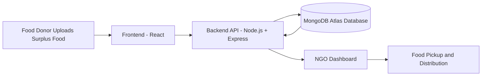

<p align="center">


</p>

---
# 🍛 Feeding Futures

### *Turning Leftovers into Lifelines*

> **What if yesterday’s leftovers could become someone’s tomorrow?**

Every night restaurants throw away food.
Every night someone sleeps hungry.

The problem isn't food.

**The problem is connection.**

**Feeding Futures** exists to connect **surplus food with human need**.

Not tomorrow.
Not someday.

**Right now.**

---

# 🌍 The Reality

```
1/3 of the world's food is wasted
yet
800M+ people sleep hungry
```

Food exists.
People exist.

The **bridge is missing**.

Feeding Futures **builds that bridge.**

---

# ⚡ The Idea

Imagine a system where:

🥗 A restaurant finishes the day with extra food
📱 They upload it in 10 seconds
📍 Nearby NGOs instantly see it
🚚 Pickup happens quickly
❤️ Someone eats instead of going hungry

Simple.

But powerful.

---

# 🧠 How the System Thinks

```
Donor uploads surplus food
        │
        ▼
Platform verifies data
        │
        ▼
Nearby NGOs get notified
        │
        ▼
NGO accepts pickup
        │
        ▼
Food reaches people
```

What used to be **waste** becomes **impact**.

---

# 🚀 Try the Platform

### User Platform

https://feedingfuturesuser.vercel.app

Upload food.
Help someone.

---

# 🧩 Who Uses Feeding Futures?

Three roles power the system.

### 🍽 Donors

Restaurants, events, offices, individuals.

They post surplus food in seconds.

### 🤝 NGOs

• NGOs can view nearby food donations
• Accept or reject pickup requests
• Efficient logistics management

### 🛠 Admin

Ensures the ecosystem runs smoothly.

---

# 🧬 The Tech Behind It
<p align="center">


</p>

```
Frontend
React + Vite + Tailwind

Backend
Node.js + Express

Database
MongoDB Atlas

Deployment
Vercel
```

A modern stack built for **speed and scale**.

---


## 📊 Data Tracking

• Donation history tracking
• Distribution monitoring
• Waste reduction insights

---

## 🔐 Secure Authentication

• JWT-based authentication
• Role-based authorization
• Protected backend APIs

---

# 🧠 System Architecture



---


# 📂 Project Structure

```bash
Feeding-Futures
│
├── frontend
│   ├── components
│   ├── pages
│   ├── hooks
│   └── services
│
├── backend
│   ├── controllers
│   ├── routes
│   ├── models
│   ├── middleware
│   └── config
│
└── README.md
```

---

# ⚙️ Installation

### Clone the repository

```bash
git clone https://github.com/namanmahajan2020/Feeding-Futures.git
```

### Navigate to the project

```bash
cd Feeding-Futures
```

### Install dependencies

```bash
npm install
```

### Run backend server

```bash
npm start
```

---

# 🔑 Environment Variables

Create a `.env` file inside the **backend folder**

Example:

```env
MONGODB_URI=your_mongodb_connection
PORT=5000
JWT_SECRET=your_secret_key
```

---

# 📸 Screenshots

Add screenshots to showcase the UI.

Example structure:

```
/screenshots

dashboard.png
food-upload.png
ngo-dashboard.png
donation-history.png
```

---


# 🌱 Future Evolution

Feeding Futures is only the beginning.

Next ideas:

```
📍 Smart location matching
🚚 Real-time pickup tracking
📊 Food waste analytics
📱 Mobile application
🤖 AI demand prediction
📡 IoT food quality sensors
```

The goal:

**Zero hunger through technology.**

---

# 📊 The Vision

If one city used Feeding Futures:

```
Restaurants   → donate food
NGOs          → distribute efficiently
People        → eat instead of starving
Food waste    → drops
```

Now imagine **100 cities.**

---

# 🤝 Contributing

Contributions are welcome!

1️⃣ Fork the repository
2️⃣ Create a feature branch
3️⃣ Commit your changes
4️⃣ Push the branch
5️⃣ Open a pull request

---

# 📜 License

This project is licensed under the **MIT License**.

---

# 👨‍💻 Author

**Naman Mahajan**

Computer Science Student
Interested in Full Stack Development, AI, and IoT
Passionate about building impactful real-world solutions.

📧 [mahajannaman2020@gmail.com](mailto:mahajannaman2020@gmail.com)

GitHub
https://github.com/namanmahajan2020

---

⭐ **If you like this project, please consider starring the repository.**


> **"Technology should not only scale businesses — it should scale compassion."**
